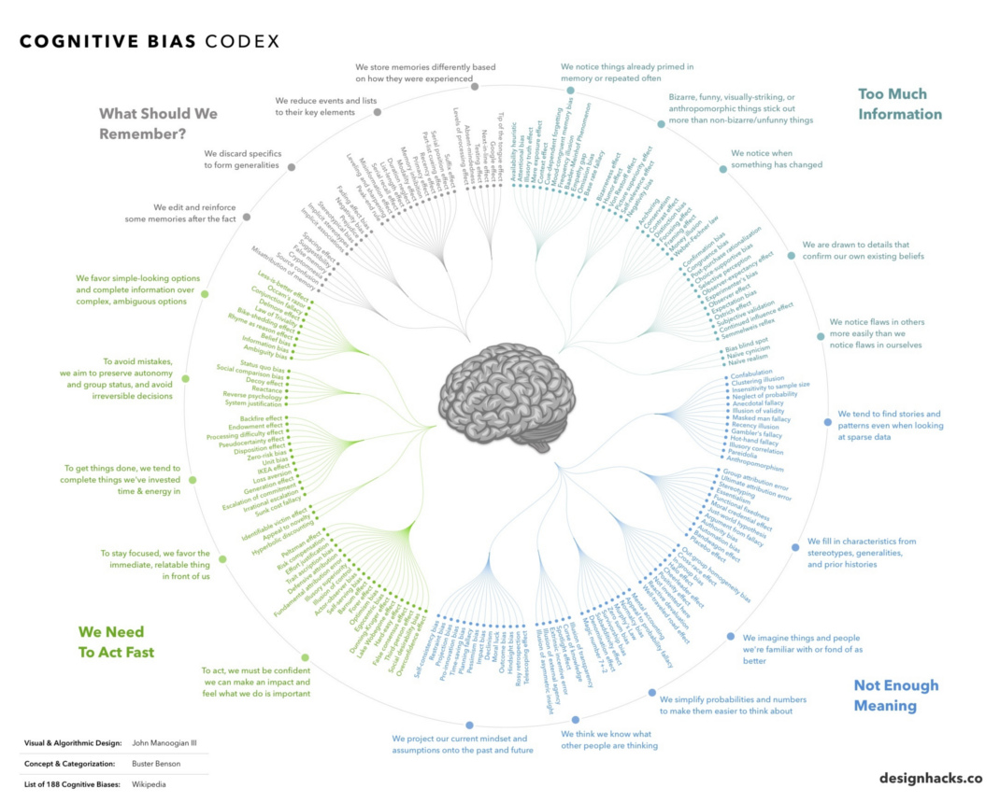

# Cognitive Biases

Have you ever had a friend who was very biased on a subject and no matter what facts you used to persuade him; it didn’t matter? He just dug his heels in deeper to stick to his bias or belief? 
Most of us have a cognitive bias on at least some topic, and usually, a lot more than just one. But why is that? 

One of the main reasons is that having a bias saves us energy and time. In our world of too much information, bias helps us to make sense of the world quickly and easily, regardless of if we are right. And because we can't grasp everything, we’ll always be missing a lot of essential information. 
It’s hard to look at oneself as a biased person, but you can use it to your advantage to create a more autonomous mindset. 

In a world that can be divided by both prejudice and bias, it’s important to understand that we may have biases that we are not aware of. And to believe that you are 100% correct on 100% of subject matters in our universe will only hurt you – not help. That’s not the scientific approach to life that we must adopt. We all must have the humility to realize that we may not know what the real truth is and to allow a certain amount of skepticism regarding our own beliefs so that we can adjust to the truth once the evidence and the facts show that we were wrong. 

What can we learn from our biases? 

Expert on the human experience Peter Baumann says that the lesson is to learn to listen better. When you recognize your own bias, then you can be open to facts that may change the way you view something. And being able to adapt your beliefs to new and changing information is one of the keys to success.
When we are aware of our own biases, we are then more understanding of others. The way to truly learn from others is to see yourself as not so perfect, not so right, and not so special (even though you are!). Humility is key, which we will discuss further in Chapter 2: The Autonomous Mindset.
We each have our subjective realities. We need to move towards an objective one.

There are several biases that we need to be aware of. One of them is the “post hoc fallacy” which is the bias that if one event precedes another, that event must be the reason for the next one. For example, it was once thought that night air was the reason for malaria. People were told to avoid going out at night. But of course, the real reason was because of mosquitos which were out at dusk. 
The placebo effect is similar. A person who doesn’t get the actual drug but instead gets a sugar pill may have biased expectations which give relief as if the actual drug was taken.
There is also the “halo effect” bias. This is the condition where, for example, we meet someone, we see one positive thing about them, and then assume that the person has many other positive traits without even knowing if they do or not. How many times have you met an attractive person, thought positive thoughts about them in every way, only later to find out that you were wrong? That’s the “halo effect.” This can also be described as the “rose-colored glasses” phenomenon when we first meet someone to who we are greatly attracted to. 

We crave rational explanations while unaware of the reasons behind our emotions. The key is to be aware that we are nearly hard-wired this way so that we can become more objective about ourselves and others. 
There is also another type of bias called the backfire effect. This is when counterarguments and negative comments cause us to entrench into our views. 
And when we form groups, we tend to believe there is a homogeneity in each other’s behavior when there isn’t. We aren’t all the same.

Even our outfit choice can influence who we are and what we do. Have you ever dressed up to go out and felt like a million bucks compared to normal? That’s a certain type of bias based on how you’re dressed. 
“Fundamental Attribution error” bias is when we attribute someone’s behavior to their character rather than their situation. A great example of this is that of the father who got onto a train with his two children. He allowed his children to run amuck, disturbing many passengers. When one of the passengers confronted the father, he apologized, and said that his wife, the children’s mother, had just unexpectedly died, leaving him in a state of shock… Imagine how quickly that passenger who confronted the father changed perspective and bias. 

“Realistic conflict theory” bias tells us that bias and conflict can happen between groups when there are limited resources and different goals.

The Power of Feeling Good
Traditional psychology focuses on the negatives without seeing the positives. However, success revolves around happiness, not the other way around. When we feel good, we are smarter, feel more motivated, and enjoy more success. Positive emotions flood our brain with dopamine and serotonin – chemicals that both make us feel good and boosts parts of the brain that are responsible for learning and organizing new information. Happiness improves all parts of our lives.

Purposely choosing to feel good gives us a performance edge. This is why it is so important to adjust your mindset to a positive one. Focus on the positive things in your life and not on the negative ones. Your focus is limited – choose wisely! 
When facing adversity, fall up rather than fall down. Fall up by turning negative momentum into positive momentum. A crisis or adversity makes our mind follow one of three paths:
No change, you ended where you started. 
Further negative consequences: you are worse off and we are afraid of this path.
The third path is we learn from it to become stronger and more capable than before.
Gaining control of your thoughts by purposely seeing everything from the most positive perspective that you can and focusing on little changes is how you can make the greatest improvements. Writing your negative feelings into words diminishes the power of the emotion. 
Now that we have covered your current mindset and how to be more introspective, now let’s get into how to develop an autonomous mindset. 

