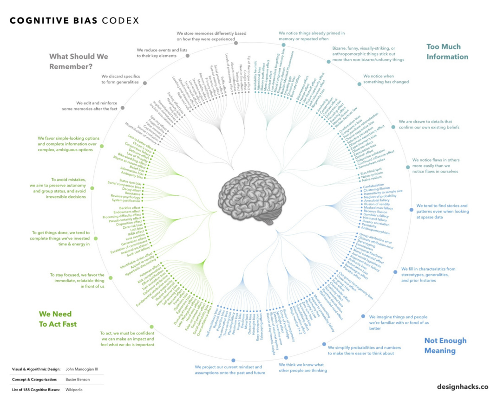

# Cognitive Biases

You must understand cognitive biases. First you must learn what they are, then attribute your behavior to them. Next, you need identify external sources that aim to expolit your biases to control you. This is the most important step in taking your life under your control.

Cognitive biases lead to perceptual distortion, inaccurate judgement, illogical interpretation. They enable you to construct a subjective reality and not an objective one. 

Understand these and free yourself from them. There are a lot.

The anti-vaxxers during covid are a prime example of a group of people led astray by social media exploiting 
cognitive biases.

They ignore an obviously negative situation(Ostritch effect). They refuse to plan for or react to a disaster that has never happened
before(Normalcy bias). They ignore the fact hospitals are full (base rate neglect). They feed of each other's social media creating an availability cascade. (Confimation bias, conformity bias).
They are unskilled individuals overestimating their ability to filter information.( The "do your own research crowd" is the Dunning-Kruger effect in full swing).
When they catch covid and are intubated, they still deny COVID exists (Conservatism bias). Anti-vaxxers believe ivermectin will save them (Optimism bias).

What can be said about climate change deniers?

In and many places in the world, the anti-vaxxers have filled up the hospitals. Their cognitive biases are litterally killing them.

If you do not understand cognitive biases, the ones that do control of your life.

* Belief, decision-making and behavioral biases.
* Social biases.
* Memory biases.

